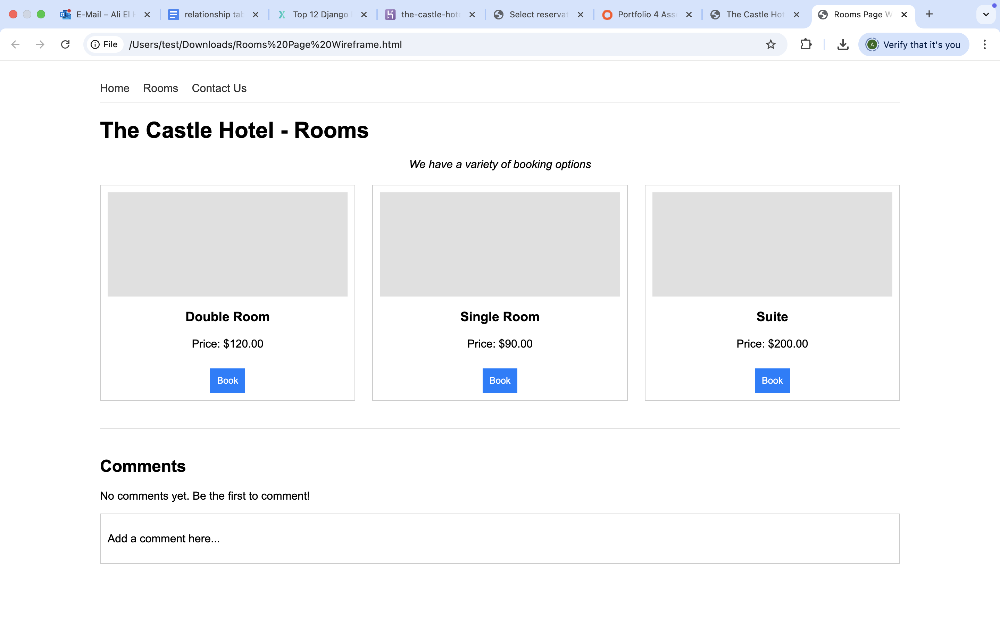
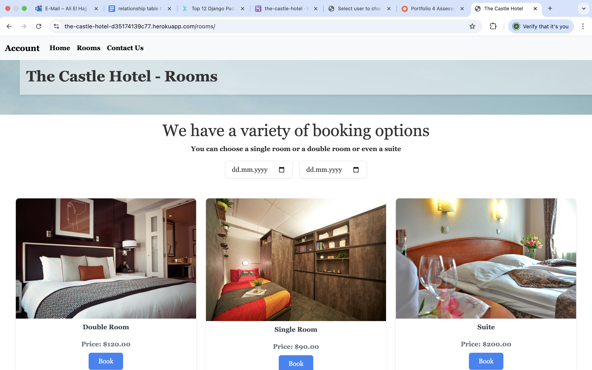
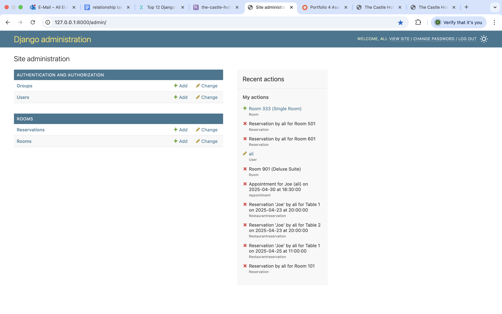
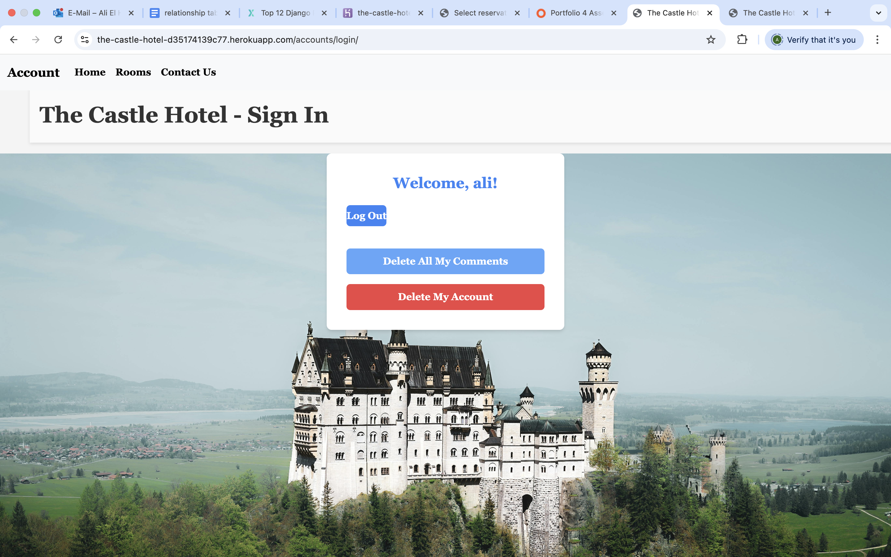
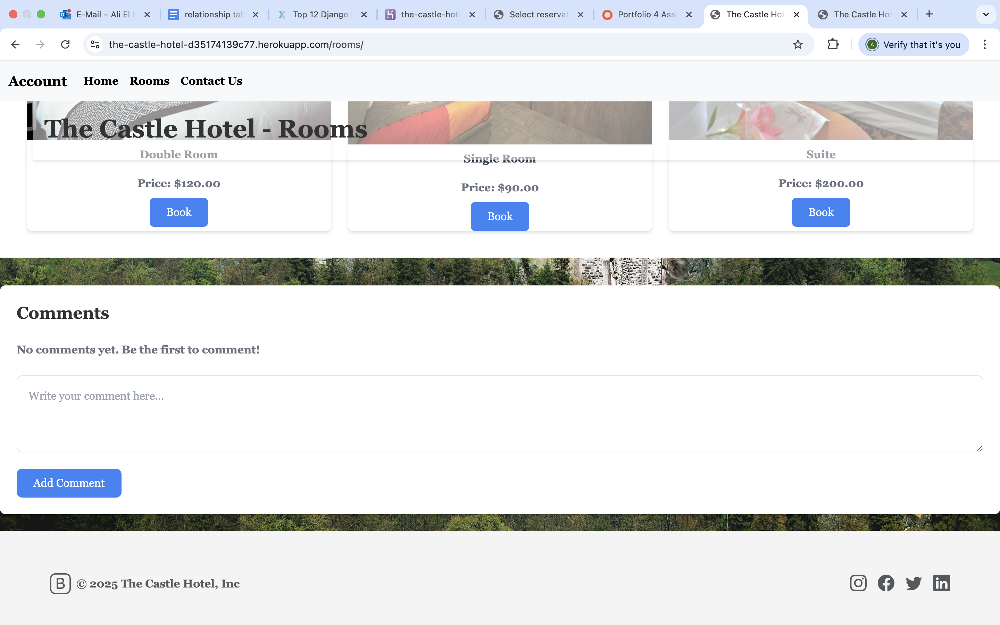

# The Castle Hotel

The Castle Hotel is a full-stack Django web application for a hotel booking experience, letting guests browse rooms, see date-based pricing, and manage reservations while administrators manage rooms, bookings, and guest data. The goal is to deliver a clear, responsive booking flow and demonstrate end-to-end CRUD, authentication, and deployment practices for a real-world hospitality project.

A hotel website with booking features.


## Wireframes




## UX & Design Process

- The landing page prioritizes a single call-to-action to guide users to booking.
- Rooms are surfaced as quick cards so users can compare types and prices fast.
- The reservation flow is split into a modal confirmation and a details form to reduce errors.
- The navigation highlights primary tasks (Rooms, Contact, Account, Reservations).

## Agile Planning

- User stories and acceptance criteria are documented in `docs/user_stories.md`.
- A lightweight sprint log is documented in `docs/sprint_plan.md`.


## User Features

As a user, I want to:
- Book rooms.
- Sign up and sign in to my account.
- post and delete comments 
- delete my profile
- be directed to the next steps on the landing page by clicking a button that takes me to booking
choose a room type and choose dates to know its price
- book a room and fill in my information for booking 


# The Castle Hotel

A modern hotel booking web application built with Django, MySQL, Tailwind CSS, Bootstrap, and JavaScript.

---

## Overview

**The Castle Hotel** is a full-featured hotel website that allows users to:
- Browse and book rooms
- Register and manage their accounts
- Post and delete comments
- Delete their own profile and all their comments
- View dynamic room pricing based on selected dates
- Enjoy a responsive, visually appealing interface

The project is designed for easy deployment on Heroku, using a managed MySQL database for production data storage.

---
## Screenshots

### Home Page


### Room Booking Page


### Admin Panel Overview


### User Profile Management


### Comments Section

## Features

### User Features
- **Sign Up / Sign In:** Secure authentication system for user accounts.
- **Room Booking:** Choose room type, select dates, and book available rooms.
- **Reservation Management:** View, edit, and delete your reservations.
- **Comment System:** Post and delete comments on rooms/pages.
- **Profile Management:** Delete all comments or delete your account from the frontend.
- **Responsive UI:** Works on desktop and mobile devices.

### Admin Features (Django Admin Panel)
- **Rooms & Reservations Overview:** See the number of rooms, types, and real room numbers.
- **Room Management:** Add, edit, or delete rooms and their details (type, price, availability).
- **Reservation Management:** View all reservations and guest information submitted via booking forms.
- **User Management:** Create, edit, or delete users.
- **Guest Management:** Add or remove guests.
- **Full Data Overview:** Access and edit all room, reservation, and guest data directly from the admin panel.

---

## Tech Stack

- **Backend:** Django (Python)
- **Database:** MySQL (local and production)
- **Frontend:** Tailwind CSS, Bootstrap 5, custom CSS (`static/css/style.css`)
- **JavaScript:** For modals, booking UI, and interactive features (`static/js/script.js`)
- **Deployment:** Heroku (with `Procfile` and `requirements.txt`)
- **Other:** Whitenoise for static file serving, Django templates

---

## Project Structure

```
the-castle-hotel/
│
├── accounts/         # User authentication and profile management
├── comments/         # Comment system
├── content/          # Static pages (home, contact, etc.)
├── rooms/            # Room models, booking, and reservation logic
├── static/           # Static files (CSS, JS, images)
├── templates/        # HTML templates (base, login, room list, etc.)
├── docs/             # Agile planning, user stories, sprint notes
├── data.json         # Sample data for initial load/backup
├── schema.sql        # SQL schema reference (legacy)
├── manage.py         # Django management script
├── requirements.txt  # Python dependencies
├── Procfile          # Heroku deployment config
├── README.md         # This file
└── ...               # Other standard Django files
```

---

## Data Model (ER Summary)

| Model        | Fields (key)                                                                 |
|--------------|-------------------------------------------------------------------------------|
| Room         | room_number, room_type, price_per_night, is_available                         |
| Reservation  | guest(FK), room(FK), check_in_date, check_out_date, total_price, guest details |
| Comment      | user(FK), text, page, created_at                                              |

---

## Setup & Installation

1. **Clone the Repository**
    ```bash
    git clone https://github.com/yourusername/the-castle-hotel.git
    cd the-castle-hotel
    ```

2. **Create and Activate a Virtual Environment**
    ```bash
    python3 -m venv venv
    source venv/bin/activate
    ```

3. **Install Dependencies**
    ```bash
    pip install -r requirements.txt
    ```

4. **Set Up Environment Variables**
    Create your MySQL database and set these environment variables:
    - `SECRET_KEY`
    - `DEBUG`
    - `MYSQL_DATABASE`
    - `MYSQL_USER`
    - `MYSQL_PASSWORD`
    - `MYSQL_HOST`
    - `MYSQL_PORT`

5. **Run Migrations**
    ```bash
    python manage.py makemigrations
    python manage.py migrate
    ```

6. **Load Sample Data (Optional)**
    ```bash
    python manage.py loaddata data.json
    ```

7. **Create a Superuser**
    ```bash
    python manage.py createsuperuser
    ```

8. **Run the Development Server**
    ```bash
    python manage.py runserver
    ```
    Visit [http://localhost:8000](http://localhost:8000) in your browser.

---

## Deployment (Heroku)

1. **Push your code to Heroku:**
    - Make sure you have a `Procfile` with:  
      ```
      web: gunicorn the_castle_hotel.wsgi
      ```
    - Make sure `requirements.txt` is up to date.

2. **Provision a MySQL database (Heroku add-on or external):**
    - Create the database and note the host, port, user, password, and database name.

3. **Set environment variables on Heroku:**
    - `SECRET_KEY`
    - `DEBUG` (set to `False` in production)
    - `MYSQL_DATABASE`
    - `MYSQL_USER`
    - `MYSQL_PASSWORD`
    - `MYSQL_HOST`
    - `MYSQL_PORT`

4. **Deploy:**
    ```bash
    git push heroku main
    ```

5. **Run migrations and collect static files:**
    ```bash
    heroku run python manage.py migrate
    heroku run python manage.py collectstatic --noinput
    ```

6. **(Optional) Load initial data:**
    ```bash
    heroku run python manage.py loaddata data.json
    ```

---

## Frontend

- **Tailwind CSS** and **Bootstrap 5** are both used for rapid, responsive UI development.
- Custom styles are in `static/css/style.css`.
- **JavaScript** (`static/js/script.js`) powers modals, booking forms, and UI interactivity.

---
## Testing

### Automated (Python)
- `python manage.py test`
- Core coverage: reservations create/edit/delete, login required checks.

### Manual (JavaScript / UI)
- Booking modal opens and shows room type, price, and dates.
- Total price updates when dates change.
- “Book” button routes to details page with query params.
- Reservation create/edit/delete flows display success messages.

---
## Debugging Checklist

| Area             | Check                                                                 |
|------------------|-----------------------------------------------------------------------|
| Environment      | All environment variables (SECRET_KEY, DB, etc.) are set              |
| Database         | Database is configured and migrations are applied                     |
| Static Files     | Static files are collected and served correctly                       |
| URLs             | All routes are included and correct                                   |
| Templates        | All required context variables are passed to templates                |
| User Auth        | Login, logout, signup, and user management forms work                 |
| Comments         | Users can add and delete comments                                     |
| Room Booking     | Users can view, select, and book rooms                               |
| Admin Panel      | Django admin is accessible and shows rooms, reservations, users, etc. |
| Deployment       | All deployment files are present and correct for Heroku               |
| Data Import      | Initial data is loaded if needed                                      |
| Removed Features | No leftover references to Wellness/Restaurant apps                    |
| Error Logs       | No errors on startup or during requests                               |
| Dependencies     | All required packages are installed                                   |
| Migrations       | All migrations are applied                                            |
| Backup           | Database and data backups exist                                       |
| Heroku Add-ons   | MySQL add-on or managed MySQL is attached and configured              |
| Session/Cookies  | Sessions and cookies work for login/logout                            |
| CSRF Protection  | All forms are protected with ``                       |
| README           | README is up to date and clear                                        |


## Services & Technologies Table

| Area             | Service / Technology Used                          |
|------------------|---------------------------------------------------|
| Environment      | Heroku (deployment), local dev environment        |
| Database         | MySQL (production and local)                      |
| Static Files     | Whitenoise, Django staticfiles, Heroku CDN        |
| URLs             | Django URL dispatcher                             |
| Templates        | Django Templates                                  |
| User Auth        | Django Authentication system                      |
| Comments         | Custom Django app (comments)                      |
| Room Booking     | Custom Django app (rooms), Django ORM             |
| Admin Panel      | Django Admin                                      |
| Deployment       | Heroku, Procfile, Gunicorn                        |
| Data Import      | Django loaddata, data.json                        |
| Removed Features | N/A (Wellness/Restaurant apps removed)            |
| Error Logs       | Heroku logs, Django runserver output              |
| Dependencies     | requirements.txt, pip                             |
| Migrations       | Django migrations                                 |
| Backup           | data.json, db.sqlite3                             |
| Heroku Add-ons   | MySQL add-on (if using Heroku)                    |
| Session/Cookies  | Django sessions, browser cookies                  |
| CSRF Protection  | Django CSRF middleware                            |
| README           | Markdown, GitHub                                  |
| Frontend (CSS)   | Tailwind CSS, Bootstrap 5, custom CSS             |
| Frontend (JS)    | Custom JavaScript (`static/js/script.js`)         |

| CSS Validation    | [W3C CSS Validator](screenshots/cssvalid.png)            |


## Development Notes

- Originally, the project included wellness and restaurant apps, but these were removed for focus and simplicity.
- The database was migrated from Railway to a managed MySQL instance due to compatibility and reliability.
- All forms are protected with CSRF tokens.
- The project is structured for easy extension and maintenance.

---

## License

This project is for educational/demo purposes.  
Contact the author for commercial use or contributions.

All images were taken from Pexels ( No license needed )
---

## Author

Ali Elhaj  
[alielhajj@outlook.de](mailto : alielhajj@outlook.de )

---

**Enjoy using The Castle Hotel!**  
For questions or issues, please open an issue or contact the author.


PROJECT REQUIREMENTS

Assessment Criteria
Learning Outcomes
Learning Outcome	Description
LO1	Use an Agile methodology to plan and design a Full-Stack Web application using an MVC framework and related contemporary technologies.
LO2	Implement a data model, application features and business logic to manage, query and manipulate data to meet given needs in a particular real-world domain.
LO3	Identify and apply authorisation, authentication and permission features in a Full-Stack web application solution.
LO4	Create manual and/or automated tests for a Full-Stack Web application using an MVC framework and related contemporary technologies
LO5	Use a distributed version control system and a repository hosting service to document, develop and maintain a Full-Stack Web application using an MVC framework and related contemporary technologies.
LO6	Deploy a Full-Stack Web application using an MVC framework and related contemporary technologies to a cloud-based platform
LO7	Understand and use object-based software concepts
Pass Performance
LO1: Use an Agile methodology to plan and design a Full-Stack Web application using an MVC framework and related contemporary technologies
Criteria	Description
1.1	Design a Front-End for a data-driven web application that meets accessibility guidelines, follows the principles of UX design, meets its given purpose and provides a set of user interactions.
1.2	Implement custom HTML and CSS code to create a responsive Full-Stack application consisting of one or more HTML pages with relevant responses to user actions and a set of data manipulation functions
1.3	Build a database-backed MVC web application that allows users to store and manipulate data records about a particular domain.
1.4	Design a database structure relevant for your domain, consisting of a minimum of one custom model.
1.5	Use an Agile tool to manage the planning and implementation of all significant functionality
1.6	Document and implement all User Stories and map them to the project within an Agile tool
1.7	Write Python code that is consistent in style and conforms to the PEP8 style guide and validated HTML and CSS code.
1.8	Include sufficient custom Python logic to demonstrate your proficiency in the language
1.9	Include functions with compound statements such as if conditions and/or loops in your Python code
1.10	Write code that meets minimum standards for readability (comments, indentation, consistent and meaningful naming conventions).
1.11	Name files consistently and descriptively, without spaces or capitalisation to allow for cross-platform compatibility.
1.12	Document and implement all User Stories within the Agile tool and map them to the project goals
1.13	Document the UX design work undertaken for this project, including any wireframes, mockups, diagrams, etc.,created as part of the design process and its reasoning. Include diagrams created as part of the design process and demonstrate that these have been followed through to implementation
LO2: Implement a data model, application features and business logic to manage, query and manipulate data to meet given needs in a particular real-world domain.
Criteria	Description
2.1	Develop the model into a usable database where data is stored in a consistent and well-organised manner.
2.2	Create functionality for users to create, locate, display, edit and delete records
2.3	All changes to the data should be notified to relevant user
2.4	Implement at least one form, with validation, that allows users to create and edit models in the backend
LO3: Identify and apply authorisation, authentication and permission features in a Full-Stack web application solution
Criteria	Description
3.1	Apply role-based login and registration functionality
3.2	The current login state is reflected to the user
3.3	Users should not be permitted to access restricted content or functionality prior to role-based login.
LO4: Create manual and/or automated tests for a Full-Stack Web application using an MVC framework and related contemporary technologies
Criteria	Description
4.1	Design and implement manual and/or automated Python test procedures to assess functionality, usability, responsiveness and data management within the entire web application
4.2	Design and implement manual and/or automated JavaScript test procedures to assess functionality, usability, responsiveness and data management within the entire web application
4.3	Document all implemented testing in the README.
LO5: Use a distributed version control system and a repository hosting service to document, develop and maintain a Full-Stack Web application using an MVC framework and related contemporary technologies
Criteria	Description
5.1	Use Git & GitHub for version control of a Full-Stack web application up to deployment, using commit messages to document the development process.
5.2	Commit final code that is free of any passwords or security-sensitive information to the repository and the hosting platform
LO6: Deploy a Full-Stack Web application using an MVC framework and related contemporary technologies to a cloud-based platform
Criteria	Description
6.1	Deploy a final version of the Full-Stack application code to a cloud-based hosting platform and test to ensure it matches the development version
6.2	Ensure that the final deployed code is free of commented out code and has no broken internal links
6.3	Document the deployment process in a README file in English
6.4	Ensure the security of the deployed version, making sure to not include any passwords in the git repository, that all secret keys are hidden in environment variables or in files that are in .gitignore, and that DEBUG mode is turned off
LO7: Understand and use object-based software concepts
Criteria	Description
7.1	Design a custom data model that fits the purpose of the project
Important: All Pass criteria must be achieved for a pass to be awarded.

It is expected that project work submitted for this unit will demonstrate the same knowledge and skills shown in HTML/CSS/JavaScript/Python Essentials modules across the grading levels. The learner demonstrates characteristics of higher-level performance as described below.

Merit Performance
To evidence performance at the MERIT level, a learner will, in general, demonstrate characteristics of performance at the MERIT level, as suggested below. However, the learner must achieve ALL listed merit criteria.

The learner has a clear rationale for the development of this project and has produced a fully functioning, well-documented, relational database-backed, Full-Stack application for a real-life audience, with a complete set of CRUD creation, reading, updating and deletion of data records features. Data validation, API handling and user feedback are all evident in the code and the working application. Templates are used to produce working features correctly. There are no logic errors in the code, and the application functions as expected.

The finished project has a clear, well-defined purpose addressing the needs of a particular target audience (or multiple related audiences) and a particular data domain. Its purpose would be immediately evident to a new user without having to look at supporting documentation. The user is kept informed of progress and actions through feedback and, where large data sets are being loaded, progress indicators.

The web application design follows the principles of UX design and accessibility guidelines, and the site is fully responsive.

Data is fully modelled and matches the schema. The schema design is documented in the README. Datastore configuration is kept in a single location and can be changed easily. Configuration and settings files are well-organised, and there are different versions for different branches.

Criteria	Description
1.1	Design a Front-End for a Full-Stack application following UX design principles, which meets accessibility guidelines, is easy to navigate and allows the user to find information and resources intuitively.
1.2	Create templates, writing code that demonstrates a solid understanding of template syntax, logic and usage
1.3	Provide evidence of refining Epics to User Stories to Tasks
1.4	Clear user acceptance criteria have been defined.
1.5	Should-have prioritised user stories should not be more than 60% of the timebox user story points total.
2.1	Design a Full-Stack application that lets the user initiate and control actions and gives immediate and complete feedback on data processes
2.2	Write robust code that is free of errors in all parts of the application.
2.3	Implement a Full-Stack application whose purpose is quickly evident to a new user.
2.4	Maintain database configuration in a single location where it can be changed easily
2.5	Maintain a Procfile, requirements.txt file, etc.
2.6	All Create, Read, Update and Delete (CRUD) functionality is present and working.
2.7	All Create, Read, Update and Delete actions are immediately reflected in the user interface.
3.1	Present a clear rationale for the development of the project in the README, demonstrating that it has a clear, well-defined purpose addressing the needs of a particular target audience (or multiple related audiences), explaining the data, and explaining the security features considered
4.1	Fully document the results of well-planned automated testing procedures to assess the website’s functionality, usability and responsiveness. Include an evaluation of bugs found and their fixes and explanation of any bugs that are left unfixed
5.1	Describe the data schema fully in the README file
5.2	Commit often for each feature/fix, ensuring that commits are small, well-defined and have clear, descriptive messages
6.1	Fully document the deployment procedure in a section in a README file, written using consistent and effective markdown formatting that is well-structured, easy to follow, and has few grammatical errors.
7.1	Implement efficient model code in the solution
Important: All Merit criteria must be achieved for merit to be awarded.

Distinction Performance
At this level, a learner will have achieved all pass and merit criteria, as described above, and will demonstrate characteristics of high-level performance as described below:

Characteristics of performance at DISTINCTION level:

The learner has documented a clear, justified rationale for a real-world application. The development of the project has resulted in a fully-functioning, interactive web application.

The finished project is judged to be publishable in its current form with an evidenced professional-grade user interface and interaction adhering to current practice. There are no logic errors in the code. Where there is a clear breach of accepted design/UX principles or accepted good practice in code organisation, these are fully justified, appropriate and acceptable to the target user. It matches the design and demonstrates the characteristics of craftsmanship in the code. The resulting application is original and not a copy of any walkthrough projects encountered in the unit

Amplification (craftsmanship)

Front-End Design

The design of the web application demonstrates the main principles of good UX design:

Information Hierarchy

semantic markup is used to convey structure - all information displayed on the site is presented in an organised fashion with each piece of information being easy to find
all information displayed on the site is presented in an organised fashion with each piece of information being easy to find
all resources on the site are easy to find, allowing users to navigate the layout of the site intuitively
information is presented and categorised in terms of its priority
User Control

all interaction with the site would be likely to produce a positive emotional response within the user. This is down to the flow of information layout, use of colour, clear and unambiguous navigation structures and all interaction feedback
when displaying media files, the site avoids aggressive automatic pop-ups and autoplay of audio; instead letting the user initiate and control such actions
users who direct to a non-existent page or resource are redirected back to the main page without having to use the browser navigation buttons
users are never asked for information that the application already has (e.g. a contact form does not ask a logged in user for an email address).
the user is shown progress indicators and feedback on transactions.
errors resulting from user or data actions are reported to the user
Consistency

evident across all pages/sections and covers interactivity as well as design
consistency across all data operations, including in the reporting
Confirmation

user and data actions are confirmed where appropriate, feedback is given at all times
Accessibility

there is clear conformity to accessibility guidelines across all pages/sections and in all interactivity
Any design decisions that contravene accepted user interaction, user experience design principles are identified and described (comments in code and/or a section in the README)

Development and Implementation

Code demonstrates characteristics of ‘clean code’

Consistent and appropriate naming conventions within code and in file naming, e.g.

file names, class names, function names and variable names are descriptive and consistent
for cross-platform compatibility, file and directory names will not have spaces in them and will be lower-case only
all HTML attributes, CSS rules, code variables and function names are consistent in format, follow standards for the language and are appropriate and meaningful
app urls are consistent
File structure

whenever relevant, files are grouped in directories by file type (e.g. an assets directory will contain all static files and code may be organised into sub-directories such as css, js, etc)
there is a clear separation between custom code and any external files (for example, library files are all inside a directory named 'libraries')
files are named consistently and descriptively, without spaces or capitalisation to allow for cross-platform compatibility.
Readability

code is indented in a consistent manner to ease readability and there are no unnecessary repeated blank lines (and never more than 2)
id/class(CSS and JavaScript)/function/variable names clearly indicate their purpose
all code is split into well-defined and commented sections
Semantic markup is used to structure HTML code
HTML, CSS, Javascript and Python are kept in separate, linked files
CSS files are linked to in the HTML file’s head element
non-trivial Javascript code files are linked to at the bottom of the body element (or bottom of the head element if needs loaded before the body HTML)
Defensive design

all input data is validated (e.g. presence check, format check, range check)
internal errors are handled gracefully and users are notified of the problem where appropriate
Comments

all custom code files include clear and relevant comments explaining the purpose of code segments
Compliant code

HTML code passes through the official W3C validator with no issues
CSS code passes through the official (Jigsaw) validator with no issues
JavaScript code passes through a linter (e.g. jslint.com) with no major issues
Python code is consistent in style and conforms to the PEP8 style guide (or another explicitly mentioned style guide, such as Google's)
Robust code

no logic errors are found when running code
errors caused by user actions are handled
where used, API calls that fail to execute or return data will be handled gracefully, with the site users notified in an obvious way
inputs are validated when necessary
navigating between pages via the back/forward buttons can never break the site, there are no broken links
user actions do not cause internal errors on the page or in the console
The entire design is implemented, providing an excellent solution to the users' demands and expectations and security consideration.

Real-world application

Understandable site-specific content is used rather than Lorem Ipsum placeholder text.
All links to external pages open in a separate tab when clicked
The final application is aligned to the user stories presented at the start of the project
Testing procedures are comprehensive, with a good level of coverage, and have been followed. All noticeable errors have been corrected or documented:

Security features and practice are evidenced

passwords and secret keys are stored in environment variables or in files that are in .gitignore and are never committed to the repository
any functionality requiring log-in is available only to logged-in users
user permissions and levels of access are appropriate
Framework conventions are followed and used correctly. Including the following:

Django:

Templates
Apps
Models
Views
Placing logic in the most relevant components demonstrates an understanding of the Model-View-Controller(Template) pattern is evident through the placing of logic in the most appropriate components.
Configuration and settings files are well-organised
Security features and practice are evidenced.

passwords and secret keys are stored in environment variables or in files that are in .gitignore and are never committed to the repository
any functionality requiring log-in is available only to logged-in users
user permissions and levels of access are appropriate
Data is well structured.

Data is fully modelled and matches the schema.
Datastore configuration is kept in a single location where it can be changed easily.
data is well-structured, organised into logical entities with clear relationships between them
all CRUD functionality is present and working, and actions are immediately reflected in the Front-End
any data used across multiple apps is shared and not duplicated.
Configuration and dependencies files are kept up to date. Separate versions/branches of these are commits where relevant. Datastore configuration is kept in a single location and can be changed easily. The datastore is not accessible to the regular user without going through the code.

Testing procedures are comprehensive, with a good level of coverage, and have clearly been followed. There is clear evidence of testing and this is demonstrated in git commits. All noticeable errors have been corrected or documented:

navigating between pages via the back/forward buttons can never break the site, there are no broken links
user actions do not cause internal errors on the page or in the console
